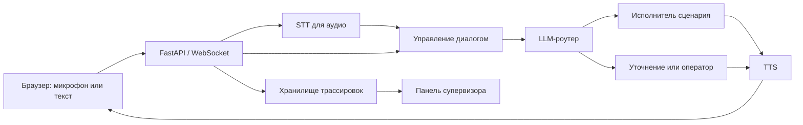

# Voice Router — HackAlem AI × Halyk

Голосовой помощник выбирает сценарий обслуживания с помощью LLM с учётом реплики клиента и истории диалога. Клиент может говорить на русском, казахском или смешивать языки. Супервизор видит выбранный сценарий, обоснование, альтернативы и время каждого этапа обработки.

> **Статус на 23 сентября 2026 года:** в `main` пока находится только исходная заглушка README; рабочее приложение ещё не собрано. В ветке `feature/Alikhan` есть отдельный прототип роутера. Описанные ниже функции — цели реализации, а не заявление о готовности. Перед сдачей команды, цифры и сценарии проверки нужно сверить с работающим проектом и официальным ТЗ.

Репозиторий команды: [BAITC-Hacks/hack-345ab97f-antennas](https://github.com/BAITC-Hacks/hack-345ab97f-antennas). В текущем `main` нет фронтенда, бэкенда, Docker Compose и стартового кита. Документ обновляем по мере слияния веток.

## Что нужно показать жюри

1. Клиент произносит запрос, робот выбирает подходящий сценарий и отвечает голосом.
2. Робот сохраняет контекст: обрабатывает несколько просьб, переключается между темами и возвращается к незавершённой.
3. При неоднозначности робот задаёт уточняющий вопрос; при необходимости передаёт разговор оператору вместе с контекстом.
4. После каждой реплики супервизор видит решение LLM, причины выбора, альтернативы и водопад задержек.
5. Команда запускает проект по инструкции в этом README и воспроизводит опубликованные результаты оценки.

Точный список обязательных проверок нужно перенести сюда из официального стартового кита, когда он будет доступен.

## Команда и зоны ответственности

| Участник | Отвечает за | Результат |
| --- | --- | --- |
| Алихан — AI Lead | LLM-роутер, промпт, JSON-схема, уверенность, несколько намерений, стек тем, переспрос и оператор; тестовые наборы, eval и сравнение 2–3 LLM; интеграция в `main` | Воспроизводимый отчёт о качестве и рабочий роутер |
| Тылеу — Backend & Voice | FastAPI, WebSocket, STT/TTS, управление диалогом, исполнение сценариев, задержка, Docker Compose | Сквозной путь от речи до ответа и трассировки |
| Сарик — Frontend, README и питч | Экран звонка, водопад трассировки, панель супервизора, редактор каталога, документация, слайды, демо и видео-бэкап; вопросы организаторам | Понятное живое демо и запуск по README |

## Порядок работы

| Этап | Проверяемый результат | Кто нужен |
| --- | --- | --- |
| 1. Контракты | Согласованы формат событий WebSocket, ответ роутера и запись трассировки | Все трое |
| 2. Текстовый сквозной путь | Текстовая реплика → LLM-решение → ответ → трассировка на экране | Алихан, Тылеу, Сарик |
| 3. Голос | Микрофон → STT → роутер → TTS → воспроизведение; проверены русский, казахский и смешанная речь | Тылеу, Сарик |
| 4. Качество диалога | Несколько намерений, смена темы, переспрос и передача оператору проверены на диалогах | Алихан, Тылеу |
| 5. Супервизор и каталог | Видны реальные трассы; добавленный сценарий начинает использоваться без переобучения | Сарик, Алихан, Тылеу |
| 6. Сдача | Чистый запуск по README, финальный eval, заполненные метрики, репетиция и видео-бэкап | Все трое |

Точность маршрутизации важнее оптимизации скорости. Новые функции добавляем после того, как работает сквозной путь.

## Архитектура

Решение о новом сценарии принимает LLM по каталогу и контексту. Короткие ответы на вопрос внутри уже выбранного сценария могут обрабатываться без нового вызова роутера; границу этого поведения нужно зафиксировать в коде и документации.

### Контракт интерфейса — на согласование

Черновой набор событий WebSocket из плана проекта:

| Направление | Событие | Нужные данные |
| --- | --- | --- |
| Браузер → сервер | `audio_chunk` | Аудиофрагмент и формат записи |
| Браузер → сервер | `speech_end` | Признак конца реплики и время клиента |
| Браузер → сервер | `text_input` | Текст для демо и запасного ввода |
| Сервер → браузер | `transcript` | Текст, язык, признак окончательной версии |
| Сервер → браузер | `route_decision` | Сценарий, решение, уверенность, альтернативы, обоснование, путь обработки |
| Сервер → браузер | `response_text`, `tts_audio` | Текст ответа и аудиофрагменты |
| Сервер → браузер | `trace` | ID реплики и длительности этапов в миллисекундах |

Окончательные названия полей, кодирование аудио, формат ошибок и способ получения истории трасс согласуют Сарик и Тылеу. Поля решения роутера Сарик сверяет с Алиханом. До интеграции интерфейс использует тестовые события **той же формы**.

## Интерфейс

- **Звонок:** начало и завершение звонка, текстовый запасной ввод, состояние микрофона, транскрипт и ответ робота. Голосовое управление подключается после рабочего текстового пути.
- **Трассировка:** для каждой реплики показываются выбранный сценарий, тип решения (`route`, `continue`, `clarify`, `handoff` или `out_of_scope`), уверенность, альтернативы, причина и водопад по этапам.
- **Супервизор:** история разговоров, исходы и измеренные задержки; агрегаты показываются только при наличии данных.
- **Каталог:** список сценариев, описания, границы и примеры; создание и сохранение сценария после появления соответствующего API.

## Быстрый старт

**Пока не проверены:** команда запуска всего приложения, обязательные ключи и адрес интерфейса. В `main` нет `docker-compose.yml`; этот раздел нужно заполнить после интеграции и проверить на чистом компьютере.

Сейчас можно отдельно изучить прототип Алихана в ветке `feature/Alikhan`, папка `router_prototype/`. Его собственный README описывает запуск: создать Python-окружение, установить `requirements.txt`, заполнить `.env` по `.env.example`, выполнить `python router.py "Хочу продлить страховку"` или `python run_eval.py`. Для вызова модели нужен API-ключ; прототип не поднимает интерфейс и голосовой конвейер.

Перед сдачей здесь должны быть: требования к Docker, копирование `.env.example`, получение ключей без публикации секретов, одна проверенная команда запуска, адрес интерфейса и способ выполнить оценку качества.

## Оценка качества и скорости

Алихан публикует методику, состав тестовых наборов, версии моделей и воспроизводимые отчёты. В README переносим только измеренные значения:

| Метрика | Значение | Источник |
| --- | --- | --- |
| Top-1 accuracy, размер набора | Прототип: 24/24 на небольшом тестовом наборе; финальный eval ожидается | `router_prototype/reports/2026-09-23_1403_gpt-4.1-mini.json` в `feature/Alikhan` |
| Accuracy: русский / казахский / смешанный | Ожидает финального eval | Отчёт `eval/` |
| Несколько намерений, смена темы и переспрос | Ожидает финального eval | Отчёт `eval/` |
| Время выбора сценария p50 / p95 | Прототип: 2519 / 3627 мс; замер сквозного пути ожидается | Тот же отчёт прототипа; серверная трассировка — после интеграции |
| Конец речи → первый звук p50 / p95 | Ожидает замера | Серверная трассировка и событие браузера |
| Сравнение 2–3 LLM | Ожидает сравнения | Отчёт bake-off |

Числа прототипа относятся только к 24 фразам и одной модели; они не доказывают качество на скрытых репликах жюри и не являются показателями готового приложения. Синтетические фразы генерируются через LLM и проверяются человеком. Отложенный набор нельзя включать в примеры промпта. Реальные записи клиентов не используются.

## Демо для питча — 5 минут 30 секунд

| Время | Что показываем |
| --- | --- |
| 0:00–0:45 | Проблема выбора неверного сценария и коротко — решение |
| 0:45–3:00 | Живой диалог: две просьбы в одной фразе, казахский, смешанная речь и смена темы; после каждого шага — трассировка |
| 3:00–3:45 | Добавление сценария в каталог и проверка, что он доступен роутеру |
| 3:45–4:45 | Архитектура, измеренная точность и водопад задержек |
| 4:45–5:30 | Ограничения и путь к применению в контакт-центре |

Если микрофон или сеть мешают живому показу, используем текстовый ввод и заранее записанное полное видео демо. Реплики для выступления окончательно выбираем после проверки реальной системы.

## Ограничения и честность демонстрации

До замеров нельзя заявлять достигнутую точность, задержку или стоимость. Если функция пока работает только на тестовых данных, интерфейс и питч должны это обозначать. Зависимость от внешних API, качество распознавания казахской речи в шуме и перенос порогов уверенности на реальные звонки описываем после тестов.

## Ближайшие задачи Сарика

- [x] Получить репозиторий и проверить содержимое `main` и рабочих веток.
- [ ] Получить стартовый кит и официальное ТЗ; сверить с этим планом.
- [ ] Согласовать события WebSocket и формат ошибок с Тылеу; поля решения и трассы — с Алиханом.
- [ ] Сделать экран звонка с текстовым вводом и тестовыми событиями согласованного формата.
- [ ] Показать одну реплику как цепочку «текст → решение → ответ → водопад».
- [ ] Подключить реальный WebSocket, затем микрофон и воспроизведение.
- [ ] Обновлять этот README после каждого работающего этапа и проверять команды буквально.
- [ ] Подготовить слайды, реплики демо, видео-бэкап и две репетиции.

## Открытые вопросы

1. Где находятся стартовый кит, официальный список обязательных проверок и каталог сценариев?
2. Какие поля и события уже реализованы в бэкенде? Как передаются ошибки и завершение вызова?
3. Какие модели и речевые сервисы выбраны по результатам замеров?
4. Какая команда действительно поднимает проект целиком и какие переменные окружения обязательны?
5. Какие цифры финального eval и замеров задержки можно воспроизвести перед жюри?

