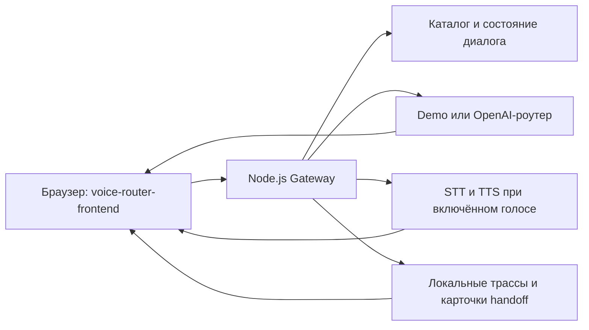

# Tyńda — Voice Router

Tyńda — прототип голосового помощника для страховой компании. Он принимает текст или речь на русском, казахском и в смешанной форме, выбирает сценарий обслуживания, показывает причину выбора и сохраняет трассировку для супервизора. Для демонстрации используйте только синтетические данные.

## Что находится в репозитории

| Компонент | Назначение | Состояние |
| --- | --- | --- |
| [voice-router-backend/](voice-router-backend/) + [voice-router-frontend/](voice-router-frontend/) | Node.js Gateway и совместимый браузерный интерфейс: звонок, трассировка, каталог, супервизор и очередь handoff | **Основное локальное демо в `main`** |
| [backend/app/router/](backend/app/router/) + [eval/](eval/) | Отдельный Python LLM-роутер, каталог сценариев и воспроизводимые инструменты оценки | Есть в `main`; к Node.js Gateway напрямую не подключены |
| [frontend/](frontend/) | Отдельный React/Vite интерфейс с собственным demo mode | В `main` запускается отдельно; его live-контракт отличается от Node.js Gateway |
| [backend/voice-api](https://github.com/BAITC-Hacks/hack-345ab97f-antennas/tree/backend/voice-api) | FastAPI + SQLite + React/Vite: текстовые и голосовые реплики, REST/WebSocket, каталог и трассировки | Отдельная проверенная ветка; ещё не слита в `main` |

Эти два серверных пути используют разные контракты. Инструкции ниже дают готовый запуск каждого пути и не предполагают, что Python-роутер уже встроен в Node.js Gateway.

## Быстрый запуск основного демо из `main`

Нужен Node.js **20.19+** и pnpm или npm. Из корня репозитория:

```powershell
cd voice-router-backend
pnpm install --frozen-lockfile
node src/server.mjs
```

Если pnpm не установлен, используйте `npm install --ignore-scripts` вместо команды установки. Откройте **http://127.0.0.1:8000**. Gateway сам отдаёт `voice-router-frontend/` и подключает его к WebSocket. Остановить сервер можно через Ctrl+C.

По умолчанию `ROUTER_MODE=demo`: ключ не нужен и платных вызовов нет. Этот режим проверяет интерфейс и транспорт на заранее заданных примерах; он **не измеряет качество LLM-маршрутизации**. Произвольная фраза может получить уточняющий вопрос.

### Включить LLM и голос

1. Скопируйте `voice-router-backend/.env.example` в `voice-router-backend/.env`.
2. Укажите `ROUTER_MODE=openai`, действующий `OPENAI_API_KEY` и доступную проекту модель в `OPENAI_MODEL`.
3. Для STT и TTS дополнительно установите `VOICE_ENABLED=true`. Модели и голос задаются `STT_MODEL`, `TTS_MODEL`, `TTS_VOICE`.
4. Перезапустите сервер и проверьте `http://127.0.0.1:8000/api/health`.

Ключ остаётся только в `.env` на сервере. Доступ к моделям и квоту нужно проверить своим аккаунтом. Реальные вызовы OpenAI, качество казахской речи и задержку от конца речи до воспроизведения команда пока не подтвердила финальным прогоном.

## Как работает основное демо



Клиент отправляет текст или PCM16 mono 16 кГц по WebSocket. Gateway возвращает транскрипт, решение, ответ и длительности этапов. Интерфейс показывает четыре экрана: звонок, трассировку, супервизор и редактор каталога. При неоднозначности робот уточняет запрос; handoff создаёт **локальную карточку**, а не соединяет с реальным оператором. Платежи, возвраты и изменения полиса не выполняются.

Каталог и последние трассы сохраняются локально в `voice-router-backend/data/state.json`. Используйте один процесс на каталог данных. Backend слушает только `127.0.0.1`; пользовательской авторизации нет, поэтому не публикуйте этот сервер в интернете.

Подробности: [backend API и ограничения](voice-router-backend/README.md), [WebSocket-контракт](voice-router-frontend/gateway-contract.json), [интерфейс](voice-router-frontend/README.md).

## React/Vite + FastAPI из ветки `backend/voice-api`

Эта ветка подключает `frontend/` к Python-серверу из `backend/app/main.py` и существующему LLM-роутеру. REST API обслуживает каталог, звонки и историю; WebSocket передаёт статусы, решение, PCM16-аудио и WAV-ответ. Диалоги сохраняются в SQLite. Ветка не заменяет Node.js Gateway в текущем `main`.

```powershell
git clone --branch backend/voice-api https://github.com/BAITC-Hacks/hack-345ab97f-antennas.git
cd hack-345ab97f-antennas
Copy-Item .env.example .env
# Заполните LLM_API_KEY и LLM_MODEL в .env
docker compose up --build
```

Откройте **http://localhost:5173/call**; API — **http://localhost:8000/docs**. Для голосового ввода установите `STT_PROVIDER=openai`; для озвучивания — `TTS_PROVIDER=openai` и при необходимости `SPEECH_API_KEY`. Текст работает при выключенных STT/TTS, если настроен LLM. Чтобы изолированно показать интерфейс без API, задайте `VITE_DEMO_MODE=true`.

Код этой ветки прошёл 19 Python-тестов, сборку TypeScript/Vite, ESLint и smoke-тесты адаптера. Docker Compose и реальные платные API-вызовы в этом окружении не запускались. [Инструкция FastAPI](https://github.com/BAITC-Hacks/hack-345ab97f-antennas/blob/backend/voice-api/backend/README.md) и [инструкция React](https://github.com/BAITC-Hacks/hack-345ab97f-antennas/blob/backend/voice-api/docs/FRONTEND_README.md).

## Отдельный Python-роутер и оценка в `main`

Python-роутер выбирает сценарий только через LLM и валидирует JSON по схеме. Его каталог читается при каждом запросе; eval-наборы не используются как примеры в промпте. Это исследовательский компонент, отдельный от основного Node.js Gateway.

```powershell
python -m venv .venv
.\.venv\Scripts\python.exe -m pip install -r requirements.txt
$env:PYTHONPATH = "backend"
.\.venv\Scripts\python.exe -m pytest backend/tests eval/tests -q
```

Подробности: [контракт роутера](docs/contracts/router.md), [методика eval](eval/README.md), [отчёты](eval/reports/). Платный eval запускается отдельно по инструкции в `eval/README.md`; не используйте holdout для настройки.

## Проверка и ограничения

- Для основного Node.js демо после установки зависимости выполните `node --test` из корня репозитория. Тесты подменяют внешние API и не требуют ключа.
- В браузере проверьте текстовую реплику, казахский и смешанный примеры, трассировку, сохранение каталога и карточку handoff. Голосовой путь требует включённых STT/TTS и доступа к моделям.
- Числа из подготовленных demo-данных нельзя выдавать за accuracy, p50/p95 или результат финального eval. Публикуйте только метрики из воспроизводимого отчёта с названием набора и модели.
- Ни один из серверов не выполняет реальные страховые операции и не предназначен для публичного production-развёртывания.

Командные правила и зоны ответственности: [AGENTS.md](AGENTS.md).
