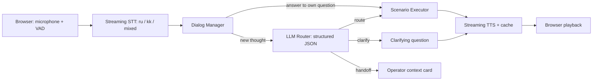

# Tyńda - голосовой робот с LLM-слоем выбора сценария

> HackAlem AI x Halyk · Кейс Voice Router
>
> Tyńda выбирает сценарий через LLM с учётом истории разговора. Супервизор видит маршрут, обоснование, альтернативы и задержку каждого этапа.

> **Статус шаблона:** команды запуска и метрики ниже нужно заменить на фактические перед сдачей. Не публикуйте примерные значения как результаты проекта.

> Это целевая архитектура, не инструкция запуска готового production. Реальный локальный backend на Node.js находится в [voice-router-backend](../voice-router-backend/README.md): JSON-хранилище вместо SQLite, Gateway, каталог, очередь карточек, OpenAI speech-адаптеры. В frontend добавлено воспроизведение TTS. Docker и make eval здесь не реализованы; реальный speech/LLM-вызов новым ключом ещё не проверен.

## Результаты за 30 секунд

| Метрика | Финальное значение |
|---|---|
| Top-1 accuracy, holdout (N = ...) | `TODO: make eval` |
| Accuracy ru / kk / mixed | `TODO: make eval` |
| Routing latency p50 / p95 | `TODO: замер Gateway` |
| Конец фразы -> первый звук p50 / p95 | `TODO: замер Gateway` |
| Clarify rate на простых фразах | `TODO: make eval` |

## Быстрый старт

```bash
git clone <REPOSITORY_URL> voice-router
cd voice-router
cp .env.example .env
docker compose up --build
```

Откройте `http://localhost:3000` и нажмите «Позвонить».

Для изолированного frontend-пакета используйте `node server.mjs`: он запускает `server.mjs` на `http://localhost:8787`. Инструкция безопасного тестового подключения к OpenAI находится в [API_SETUP.md](./API_SETUP.md); production-маршрутизацию следует выполнять только через Gateway.

### Переменные окружения

```dotenv
LLM_PROVIDER=<provider>
LLM_API_KEY=<secret>
STT_PROVIDER=<provider>
STT_API_KEY=<secret>
TTS_PROVIDER=<provider>
TTS_API_KEY=<secret>
```

Ключи не входят в репозиторий и не нужны для локального frontend mock из папки `frontend/`.

## Сценарий проверки для жюри

1. «Я вчера оплатил, деньги списались, а заказ не подтвердился. И адрес надо поменять».
   - Ожидаем `payment_not_confirmed`; `change_delivery_address` остаётся в очереди.
2. Казахская реплика: «Төлемім неге өтпей қалды?».
   - Ожидаем `payment_failed`.
3. Смешанная реплика: «Полисімді продлить керек, бірақ бағасын да айтыңызшы».
   - Ожидаем `policy_renewal` с дополнительным вопросом о цене.
4. Неоднозначная фраза: «Хочу отменить операцию».
   - Ожидаем `clarify`, а не угадывание между отменой и возвратом.
5. Откройте «Супервизор».
   - Проверьте текст, выбранный сценарий, причину, альтернативы и водопад задержек.
6. Откройте «Каталог», добавьте сценарий, сохраните и повторите запрос.
   - Следующий LLM-вызов должен получить новый каталог без переобучения.

## Как это работает



| Слой | Ответственность | Контракт |
|---|---|---|
| Frontend | микрофон, VAD, звук, звонок, trace, супервизор, каталог | WebSocket + REST |
| Gateway | аудиопоток, оркестрация, timestamp | WebSocket |
| Dialog Manager | состояние, слоты, стек тем, число переспросов | Pydantic-модели |
| LLM Router | выбор нового сценария, альтернативы, причина | structured JSON |
| Executor | бизнес-действие, подтверждение необратимых операций | mock backend |
| Trace Store | история решений и задержки | SQLite |

## LLM-роутер

Роутер получает неизменяемый каталог сценариев, историю диалога, активный сценарий, заполненные слоты, текущую реплику и язык из STT. Он возвращает JSON, где `scenario_id` стоит первым для early commit:

```json
{
  "scenario_id": "payment_not_confirmed",
  "decision": "route",
  "confidence": 0.86,
  "additional_intents": [
    {"scenario_id": "change_delivery_address", "confidence": 0.81}
  ],
  "alternatives": [
    {"scenario_id": "refund_request", "confidence": 0.09, "why_not": "Клиент не просит вернуть деньги"}
  ],
  "language": "ru",
  "reason": "Деньги списаны, но заказ не подтверждён"
}
```

Порог `route` и `clarify` выбирается по holdout-набору. Не используйте самооценку модели как единственный confidence: учитывайте logprobs и отрыв первого кандидата от второго.

## Почему это не intent-классификатор

Новый сценарий выбирает LLM по описанию, границам сценария и контексту диалога. В проекте нет обученной модели, которая сопоставляет конкретную фразу с фиксированным классом. Супервизор добавляет сценарий текстом в каталог, а следующий LLM-вызов видит это изменение сразу.

`Fast path` допустим только для короткого ответа на вопрос, который робот задал внутри уже выбранного сценария. При новой мысли решение всегда принимает LLM.

## Оценка качества

```bash
make eval
```

Команда должна сохранять версию промпта, модель, датасет и отчёт в `eval/reports/`. До финала разделите данные на tune и holdout; примеры holdout не должны попасть в каталог или промпт.

Обязательные срезы: ru, kk, mixed, смена темы и стык соседних сценариев. Дополнительно измеряйте top-3 recall, confident-wrong rate и clarify rate на очевидных фразах.

## Задержка

Trace хранит времена `endpoint`, `stt`, `route`, `exec`, `first_audio` и `total`. В интерфейсе показывается водопад для каждого поворота, а в отчёте - p50/p95 по этапам.

Решение допускает early commit: запуск сценария после `scenario_id`, до окончания объяснения модели. Стартовые фразы TTS можно прогреть в кэше. Оба улучшения должны быть измерены, а не заявлены без цифр.

## Как добавить сценарий без разработчика

1. Откройте вкладку «Каталог».
2. Задайте ID, назначение, границу с ближайшими сценариями и примеры на русском и казахском.
3. Сохраните запись.
4. Повторите запрос и проверьте, что Gateway передал обновлённый каталог в следующий вызов роутера.

## Безопасность и приватность

- Используем синтетические данные и голоса участников, не реальные клиентские звонки.
- Необратимые действия требуют явного подтверждения клиента.
- Текст пользователя помечается как данные, а не как инструкция для роутера.
- API-ключи хранятся только в `.env` или менеджере секретов.

## Ограничения

- Поддержку казахского, потоковый режим и стоимость выбранных STT/TTS провайдеров нужно подтвердить speech bake-off.
- Внешние API могут добавить сетевую задержку или стать недоступны. Fallback: второй адаптер или честная передача оператору.
- Пороги confidence требуют перекалибровки на реальном трафике.
- Перед запуском в реальном контакт-центре нужны отдельная политика хранения данных, безопасность и нагрузочное тестирование.

## Команда

| Роль | Ответственность |
|---|---|
| AI Lead | router, каталог, eval, confidence |
| Backend & Voice | Gateway, WebSocket, STT/TTS, executor, Docker |
| Frontend | звонок, trace, супервизор, редактор каталога, README, питч |

## Перед сдачей

- [ ] `docker compose up --build` проверен на чистом ноутбуке.
- [ ] `make eval` выполнен на holdout, цифры выше обновлены.
- [ ] В демо есть две казахские и одна mixed-реплика.
- [ ] Видны причина, альтернативы и waterfall после каждой реплики.
- [ ] Операторская карточка и handoff проверены.
- [ ] Записан video backup и проверено воспроизведение офлайн.
- [ ] В истории git нет ключей и нет хардкода проверочных фраз.
